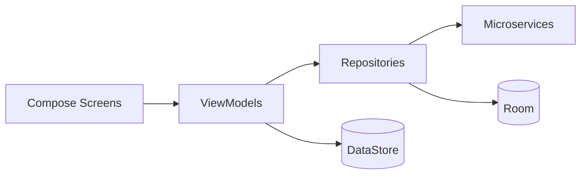

# LeaseFlow

Aplicacion movil Android para la gestion de arriendos, propiedades, solicitudes, documentos, contacto y resenas sobre una arquitectura de microservicios.

El proyecto esta implementado con Kotlin + Jetpack Compose, usa MVVM con repositorios, cache local con Room y sesion persistida con DataStore.

## Estado actual del proyecto

Estado validado en este repositorio:
- El modulo Android se encuentra en `LeaseFlow/`.
- La app compila correctamente en `debug`.
- `compileDebugKotlin` y `assembleDebug` terminan exitosamente.
- La integracion de red actual usa Azure Container Apps, no puertos locales por defecto.
- La sesion del usuario fue unificada en `UserPreferences` con soporte para `authToken`.
- El cliente HTTP envia `X-App-Client` en todas las requests y `Authorization: Bearer ...` cuando existe token.
- La suite de tests existe, pero hoy no esta completamente alineada con las firmas actuales de produccion: `testDebugUnitTest` falla por tests desactualizados.

## Funcionalidades implementadas

- Autenticacion y registro de usuarios.
- Roles diferenciados para arrendatario, propietario y administrador.
- Catalogo de propiedades con filtros y priorizacion por cercania cuando hay permisos de ubicacion.
- Detalle de propiedad con creacion de solicitudes.
- Gestion de solicitudes de arriendo con vistas por rol.
- Gestion de documentos del usuario y flujo de revision administrativa.
- Panel administrativo para usuarios, propiedades, documentos y contacto.
- Formulario de contacto y vista de gestion de mensajes.
- Resenas de propiedades y usuarios.
- Persistencia local de catalogos y datos de apoyo con Room.

## Stack tecnico

Android y UI:
- Kotlin 2.0.21
- Jetpack Compose
- Material 3
- Navigation Compose 2.9.5
- Lifecycle ViewModel + `collectAsStateWithLifecycle`
- Coroutines

Datos y red:
- Room 2.6.1 con KSP
- DataStore Preferences
- Retrofit 2.9.0
- OkHttp 4.12.0
- Gson 2.10.1
- Coil 2.7.0

Servicios del dispositivo:
- Google Play Services Location
- Camara
- FileProvider

Configuracion Android:
- AGP 8.13.1
- Gradle 8.13
- compileSdk 36
- targetSdk 36
- minSdk 24
- JVM target 11

## Arquitectura

El proyecto sigue un enfoque MVVM + Repository:

- `ui/screen/`: pantallas Compose.
- `ui/viewmodel/`: estado, validaciones, coordinacion de casos de uso y llamadas a repositorios.
- `data/repository/`: integracion con microservicios y acceso a datos locales.
- `data/local/`: Room, DAOs, entidades y almacenamiento de sesion.
- `data/remote/`: APIs Retrofit, DTOs y cliente HTTP.
- `domain/validation/`: validadores reutilizables del dominio.

Flujo general:



## Seguridad y sesion

La capa de red actual trabaja con tres mecanismos:

- `X-App-Client`: header global inyectado por `RetrofitClient` en todas las requests.
- `Authorization: Bearer <token>`: se agrega automaticamente si `authToken` existe en `DataStore`.
- `X-Usuario-Id` y `X-Rol-Id`: headers enviados explicitamente en endpoints protegidos desde los repositorios.

La sesion se centraliza en:
- `LeaseFlow/app/src/main/java/com/leaseflow/app/data/local/storage/UserPreferences.kt`

Ese archivo expone:
- `UserSessionData`
- `data: Flow<UserSessionData>`
- `authToken`
- `setAuthToken()`
- persistencia de `userId`, `userRole`, `userEmail`, `userName` e indicador `isLoggedIn`

## Microservicios configurados

Las URLs base actuales apuntan a Azure Container Apps desde `RetrofitClient`:

- User Service: `https://userservice.calmbeach-1addaf50.brazilsouth.azurecontainerapps.io/`
- Property Service: `https://propertyservice.calmbeach-1addaf50.brazilsouth.azurecontainerapps.io/`
- Document Service: `https://documentservice.calmbeach-1addaf50.brazilsouth.azurecontainerapps.io/`
- Application Service: `https://applicationservice.calmbeach-1addaf50.brazilsouth.azurecontainerapps.io/`
- Contact Service: `https://contactservice.calmbeach-1addaf50.brazilsouth.azurecontainerapps.io/`
- Review Service: `https://reviewservice.calmbeach-1addaf50.brazilsouth.azurecontainerapps.io/`

Importante:
- El README anterior hablaba de puertos locales; eso ya no representa el estado real del proyecto.
- Aunque `usesCleartextTraffic` sigue habilitado en el manifest para escenarios de desarrollo, la configuracion actual de red usa HTTPS.

## Estructura real del repositorio

Raiz del repositorio:
- `README.md`
- `LeaseFlow/` proyecto Android Gradle

Dentro de `LeaseFlow/app/src/main/`:
- `java/com/leaseflow/app/MainActivity.kt`
- `java/com/leaseflow/app/navigation/`
- `java/com/leaseflow/app/ui/components/`
- `java/com/leaseflow/app/ui/screen/`
- `java/com/leaseflow/app/ui/viewmodel/`
- `java/com/leaseflow/app/data/local/`
- `java/com/leaseflow/app/data/remote/`
- `java/com/leaseflow/app/data/repository/`
- `java/com/leaseflow/app/domain/validation/`
- `res/`
- `AndroidManifest.xml`

Tests:
- `LeaseFlow/app/src/test/`: tests JVM
- `LeaseFlow/app/src/androidTest/`: tests instrumentados

## Pantallas principales

Las pantallas presentes hoy en el proyecto incluyen:

- `WelcomeScreen`
- `LoginScreen`
- `RegisterScreen`
- `HomeScreen`
- `CatalogoPropiedadesScreen`
- `PropiedadDetalleScreen`
- `SolicitudesScreen`
- `SolicitudDetalleScreen`
- `MisPropiedadesScreen`
- `MisArriendosScreen`
- `MisDocumentosScreen`
- `PerfilUsuarioScreen`
- `ContactScreen`
- `AdminPanelScreen`
- `GestionPropiedadesScreen`
- `GestionDocumentosScreen`
- `GestionUsuariosScreen`
- `UserManagementScreen`

## Base de datos local

La app usa Room mediante `LeaseFlowDatabase`.

Uso actual:
- cache local de entidades principales
- catalogos maestros
- soporte de fallback en algunos flujos cuando el backend no entrega toda la informacion enriquecida

Notas importantes del estado actual:
- el proyecto convive con datos remotos y locales
- algunos ViewModels hacen enriquecimiento adicional consultando otros servicios cuando un DTO no trae toda la relacion necesaria

## Solicitudes y enriquecimiento de datos

El flujo de solicitudes es una de las partes mas importantes de la app:

- `SolicitudArriendoDTO` es la entidad remota base.
- Puede venir con `usuario` y `propiedad` anidados o solo con IDs.
- `SolicitudesViewModel` transforma la respuesta a `SolicitudConDatos` para la UI.
- Cuando falta detalle de propiedad, el cliente consulta `PropertyService`.
- En el detalle de una solicitud, tambien se consulta `DocumentService` para verificar documentos aprobados del solicitante.

Esto permite mostrar en UI:
- datos de la propiedad
- datos del solicitante
- estado de la solicitud
- validacion documental del usuario

## Pruebas automatizadas

Actualmente existen tests de varios tipos en `app/src/test`:

- Unitarios
- Integracion
- Con mocks
- Criterios de aceptacion
- Carga
- Estres

Ejemplos presentes en el repositorio:
- `LeaseFlowValidatorsTest.kt`
- `SafeApiCallIntegrationTest.kt`
- `ContactViewModelMockTest.kt`
- `ContactFormAcceptanceTest.kt`
- `LeaseFlowValidatorsLoadTest.kt`
- `LeaseFlowValidatorsStressTest.kt`

Estado real al momento de esta actualizacion:
- `assembleDebug` pasa
- `testDebugUnitTest` no pasa todavia
- la causa actual es desalineacion entre varios tests y las nuevas firmas de ViewModels/repositorios tras la refactorizacion de sesion, headers y tipos protegidos

Por eso, hoy el proyecto esta mas estable en compilacion de aplicacion que en cobertura de tests automatizados.

## Requisitos de desarrollo

- Android Studio
- JDK 11
- Gradle Wrapper incluido
- Emulador Android o dispositivo fisico para ejecutar la app

## Como ejecutar

1. Abrir `LeaseFlow/` en Android Studio.
2. Esperar la sincronizacion de Gradle.
3. Ejecutar el target `app` en un emulador o dispositivo.

Comandos utiles desde `LeaseFlow/`:

```powershell
.\gradlew.bat compileDebugKotlin
.\gradlew.bat assembleDebug
.\gradlew.bat testDebugUnitTest
```

En el estado actual:
- `compileDebugKotlin` funciona
- `assembleDebug` funciona
- `testDebugUnitTest` requiere ajustes adicionales

## APK generado

La build `debug` se puede generar con:

```powershell
.\gradlew.bat assembleDebug
```

Ruta esperada del APK:
- `LeaseFlow/app/build/outputs/apk/debug/`

## Manifest y permisos

El `AndroidManifest.xml` declara:

- `INTERNET`
- `ACCESS_FINE_LOCATION`
- `ACCESS_COARSE_LOCATION`
- `CAMERA`
- `FileProvider`

Tambien mantiene:
- `usesCleartextTraffic="true"`
- `networkSecurityConfig`

## Problemas conocidos

- La suite JVM no esta completamente sincronizada con las firmas actuales de produccion.
- Existen warnings deprecados de Compose/Java que no bloquean la build, pero aun no fueron limpiados.
- No hay evidencia automatizada de ejecucion en dispositivo dentro de este entorno; la validacion realizada fue de compilacion y empaquetado.
- Algunos flujos de enriquecimiento de datos del lado cliente siguen siendo costosos, especialmente solicitudes asociadas a propiedades de un propietario.

## Resumen honesto del estado actual

Si necesitas una foto rapida del proyecto hoy:

- La app Android compila.
- El APK debug se genera.
- La integracion con microservicios esta configurada para Azure.
- La sesion y los headers de seguridad ya estan conectados en la app.
- El README anterior estaba desactualizado en red, seguridad y estado de tests.
- Este documento fue reescrito para reflejar el estado real del repositorio actual.
